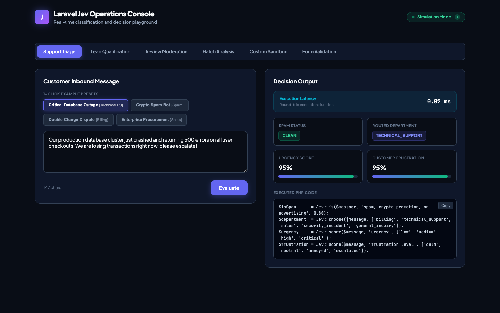
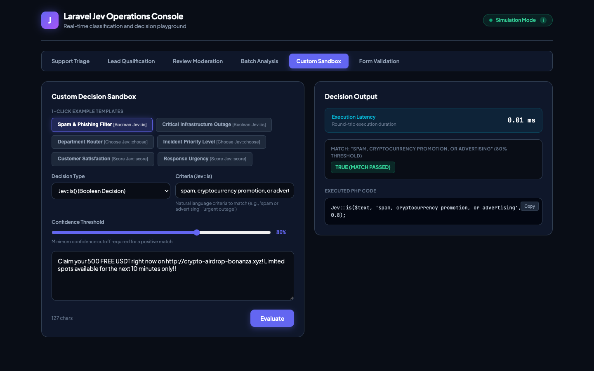
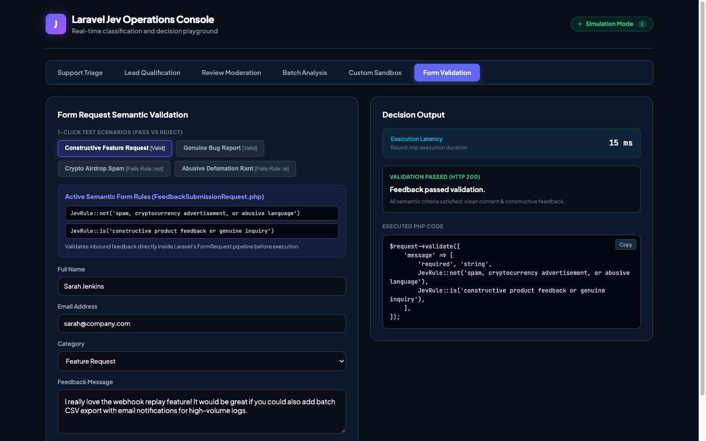

# Laravel Jev Demo Application

[](https://laravel.com)
[](https://php.net)
[](https://packagist.org/packages/i-priyanshuverma/laravel-jev)
[](LICENSE)

A reference application demonstrating real-world implementations of the **[laravel-jev](https://github.com/i-priyanshuverma/laravel-jev)** package in a modern Laravel 12 codebase.

<p align="center">
  
</p>

---

## What is Laravel Jev?

**Laravel Jev** integrates TypeSafe's sub-100ms neural classification models directly into Laravel workflows. It replaces fragile regex rules and slow multi-second LLM prompt chains with type-safe, sub-100ms semantic evaluations:

- **Sub-100ms Latency**: Real-time evaluation directly in HTTP request lifecycles.
- **Zero Prompt Engineering**: Clean PHP API with natural language criteria.
- **Offline Simulation Support**: Full development and testing without API keys using `Jev::fake()`.

---

## Core Examples

Here is how semantic decisions are written in standard Laravel controllers, jobs, and form requests:

### 1. Semantic Boolean Matching (`Jev::is`)
Evaluate whether arbitrary text meets natural language criteria with confidence thresholding:

```php
use Priyanshu\LaravelJev\Facades\Jev;

// Detect spam, phishing, or abusive promotions
$isSpam = Jev::is($message, 'spam, crypto promotion, or advertising', threshold: 0.80);

// Check if an inbound request signals an urgent infrastructure outage
$isOutage = Jev::is($ticket, 'critical production system outage or database downtime', threshold: 0.85);
```

### 2. Categorical Routing (`Jev::choose`)
Classify and route unstructured user input into discrete application categories:

```php
// Route inbound customer message to the optimal team
$department = Jev::choose($message, [
    'billing',
    'technical_support',
    'sales',
    'security_incident',
    'general_inquiry',
], default: 'general_inquiry');
```

### 3. Numerical Scoring (`Jev::score`)
Score unstructured text across an ordered scale (normalized to a `0.0` - `1.0` float):

```php
// Rate ticket urgency across an ordered scale
$urgency = Jev::score($message, 'urgency', ['low', 'medium', 'high', 'critical']);

// Assess customer frustration level
$frustration = Jev::score($message, 'frustration level', ['calm', 'neutral', 'annoyed', 'escalated']);
```

### 4. Single Round-Trip Batch Analysis (`Jev::analyze`)
Evaluate multiple criteria in a single network round-trip for maximum efficiency:

```php
$batch = Jev::analyze($ticketText)
    ->is('actionable', 'Is this request immediately actionable by a support human?')
    ->choose('team', ['billing', 'infrastructure', 'product_support', 'security'])
    ->score('urgency', ['p3_low', 'p2_medium', 'p1_high', 'p0_blocker'])
    ->run();

if ($batch->is('actionable')) {
    Ticket::create([
        'team' => $batch->choice('team'),
        'urgency' => $batch->score('urgency'),
    ]);
}
```

### 5. Native Form Request Validation (`JevRule`)
Enforce semantic validation rules inside standard Laravel FormRequests before reaching controller logic:

```php
namespace App\Http\Requests;

use Illuminate\Foundation\Http\FormRequest;
use Priyanshu\LaravelJev\Rules\JevRule;

class FeedbackSubmissionRequest extends FormRequest
{
    public function rules(): array
    {
        return [
            'name'    => ['required', 'string', 'max:100'],
            'email'   => ['required', 'email'],
            'message' => [
                'required',
                'string',
                'min:10',
                JevRule::not('spam, cryptocurrency advertisement, or abusive language'),
                JevRule::is('constructive product feedback or genuine inquiry'),
            ],
        ];
    }
}
```

---

## Interactive Capabilities

### 1. Operations Console (`/`)
Live workbench featuring 1-click test presets for realistic inbound event streams:
- **Support Triage**: Evaluates inbound tickets, flags spam, routes to departments, and scores urgency and customer frustration.
- **Sales Lead Qualification**: Detects enterprise buyer intent, assigns tiers (`enterprise_account`, `mid_market`, `self_serve_starter`), and estimates deal scale.
- **Review Moderation**: Flags toxic or defamatory reviews, categorizes topics, and rates sentiment on a 5-point scale.
- **Batch Evaluation**: Evaluates multiple dimensions in a single HTTP request using `Jev::analyze()`.
- **Latency Tracker**: Displays real-time round-trip execution latency for each decision.
- **Executed PHP Code Inspector**: Reveals the exact PHP code and criteria executed for each scenario.

### 2. Custom Rule Sandbox
An interactive playground within the console to test arbitrary custom criteria:
- **Boolean mode** (`Jev::is`) with adjustable confidence threshold slider.
- **Categorical selection** (`Jev::choose`) with custom comma-separated options.
- **Numerical scoring** (`Jev::score`) with custom ordered scale levels.

<p align="center">
  
</p>

### 3. Native Form Request Validation Playground
An interactive feedback form backed by `FeedbackSubmissionRequest` showcasing instant rejection (HTTP 422) for spam/abuse and acceptance (HTTP 200) for constructive input.

<p align="center">
  
</p>

### 4. Interactive Terminal CLI
A companion Artisan command (`php artisan jev:demo`) built with Laravel Prompts for exploring scenarios and custom rules directly in your terminal.

---

## Project Structure

This demo demonstrates clean architectural patterns for integrating Jev into a Laravel application:

```text
app/
├── Console/Commands/
│   └── JevDemoCommand.php             # Interactive terminal walkthrough (php artisan jev:demo)
├── Enums/
│   └── TriageScenario.php             # Backed enum for triage scenario identifiers
├── Http/
│   ├── Controllers/
│   │   └── TriageController.php       # JSON API endpoints for the web console
│   └── Requests/
│       ├── AnalyzeScenarioRequest.php # Dedicated Form Request validating scenario & prompt
│       ├── CustomSandboxRequest.php   # Dedicated Form Request validating sandbox mode & rules
│       └── FeedbackSubmissionRequest.php # Form Request with JevRule validation
├── Services/
│   ├── DemoJevFake.php                # Heuristic offline simulation engine extending JevFake
│   ├── DemoJevManager.php             # Custom JevManager supporting simulation overrides
│   └── TriageService.php              # Service layer encapsulating Jev decision logic & fakes
└── Support/
    └── PresetCatalog.php              # Centralized repository of demonstration presets & test prompts
resources/views/
└── triage.blade.php                   # Single-file operations console UI (vanilla CSS & JS)
tests/Feature/
└── TriageTest.php                     # 13 automated feature tests covering all scenarios & validation rules
```

---

## Getting Started

### Requirements
- PHP 8.2+
- Composer

### Installation & Run Locally

```bash
git clone https://github.com/i-priyanshuverma/laravel-jev-demo.git
cd laravel-jev-demo

composer install
php artisan serve
```

Open `http://localhost:8000` to access the operations console.

### Running the Terminal CLI

```bash
php artisan jev:demo
```

### Running the Test Suite

```bash
php artisan test
```

Check code style formatting with Laravel Pint:

```bash
vendor/bin/pint --test
```

---

## Simulation vs. Live API Mode

By default, the application runs with an offline simulation driver (`Jev::fake()`), configured via `config('jev.simulate')` in `config/jev.php`. This allows exploring the console, running the CLI, and executing the test suite without an external API key.

To connect to the live TypeSafe Jev API:
1. Obtain an API key from [TypeSafe](https://typesafe.ai).
2. Set these environment variables in your `.env` or Laravel Cloud dashboard:
   ```env
   JEV_API_KEY=your_typesafe_api_key_here
   JEV_SIMULATE=false
   ```

---

## Core Package

For package documentation, configuration options, and installation instructions for your own applications, visit the **[Laravel Jev Repository](https://github.com/i-priyanshuverma/laravel-jev)** (`i-priyanshuverma/laravel-jev`).

---

## License

This demo application is open-sourced software licensed under the [MIT license](LICENSE).
